# Awan-Cast

**A regime-selective tropical solar nowcasting and tariff-aware scheduling system for Malaysian rooftop solar.**

*2nd SEDA Innovation Challenge (SIC) 2026 — Category B (Prototype), Scope 6.*

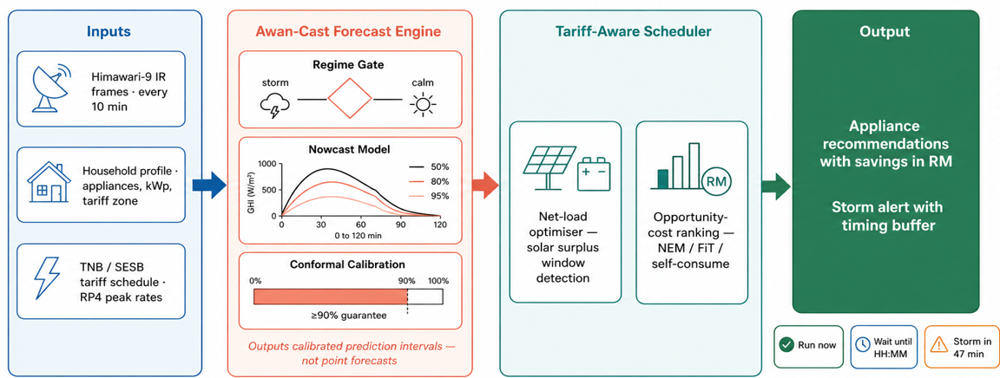

---

## Overview

Malaysia is scaling rooftop solar rapidly under the National Energy Transition Roadmap, but tropical weather makes generation volatile: a passing storm can cut rooftop output by **more than 70% within minutes**, undermining household self-consumption and grid stability. Awan-Cast is a short-horizon solar forecasting and scheduling system built for the Malaysian tropics around one insight:

> The dominant source of forecast error is not ordinary cloud movement, but the **moment a storm forms** — where errors run roughly **three times larger** than at other times.

Instead of spending expensive computation everywhere, Awan-Cast concentrates it exactly where the value is. It then converts the forecast into money-saving action, priced against the three real Malaysian solar billing schemes.

This repository contains the **experiment code and results** behind the system, plus a visual walkthrough of the working prototype. Every headline figure here is reproducible from the scripts in [`experiments/`](experiments/).

---

## Highlights

- **Storm-onset skill.** Learned nowcasting improves 120-minute storm-onset forecast skill by **33.5%** (95% CI 31.8–35.4) versus smart-persistence, winning on **96.6% of 261 test days** at a ground-truth NSRDB site.
- **Generalises across Malaysia.** The onset gain holds at three regions — Petaling Jaya **33.5%**, Kuching **25.8%**, Kota Kinabalu **28.8%** — all confidence intervals excluding zero.
- **The regime-selective gate.** Routing only storm-onset pixels to the heavy model captures **92.1%** (95% CI 87.6–95.8) of the full accuracy benefit at roughly **40% of the compute cost**.
- **Trustworthy uncertainty.** A regime-conditioned conformal calibration lifts convective-hour interval coverage from **0.86 to 0.94**, holding by construction even in the worst month.
- **Economic value.** In a hardened simulation on *real* commercial load and a *real* causal forecast priced at the Malaysian RP4 tariff, a solar-plus-battery site avoids on the order of **RM 638k / year** in peak-demand charges *(projection, not a measured deployment result — see [Honesty note](#honesty-note))*.

---

## The three-layer architecture

Awan-Cast combines three coordinated layers.

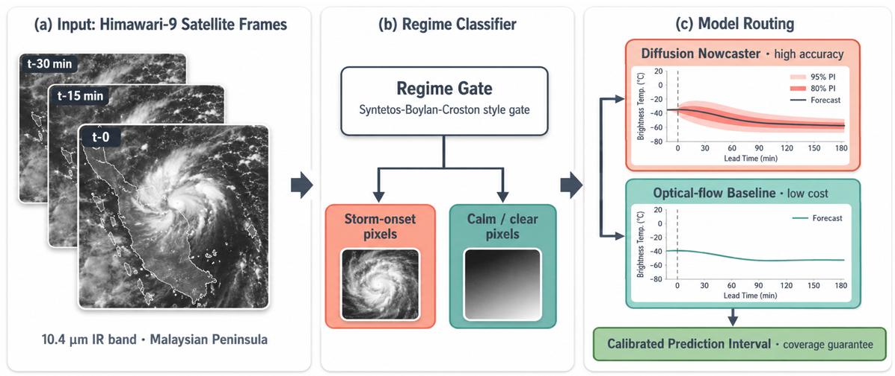

1. **Physics baseline + regime-selective gate.** A fast optical-flow / clear-sky nowcast runs everywhere; a lightweight onset detector (AUC ≈ 0.81) classifies each part of the sky and routes only the **storm-onset** pixels to the accurate deep model, sending calm regions to the cheap baseline.
2. **Learned residual correction + calibrated uncertainty.** A learned correction sharpens the forecast, and conformal calibration attaches a **prediction interval with a coverage guarantee** rather than a bare point estimate. Storm hours automatically receive wider intervals.
3. **Tariff-aware scheduler.** The forecast is converted into concrete action — scheduling flexible appliances and battery dispatch — priced against all three Malaysian schemes: **Solar ATAP** (Peninsula), **Net Energy Metering** (Sarawak), and **Self-Consumption** (Sabah).

---

## Key results

All results are computed with a fixed random seed and reported with confidence intervals where applicable. Full write-ups are in the `experiments/RESULT_*.md` files; the manifest with exact commands is [`experiments/README.md`](experiments/README.md).

| Theme | Result | Evidence |
|---|---|---|
| Storm onset is the real problem | Onset MAE ≈ **3×** overall MAE; learned model beats smart-persistence by 31–33% at 120 min | `RESULT_B1.md`, `significance_b1_results.json` |
| Significance | 120-min onset gain **33.5%** [31.8–35.4], wins **96.6%** of 261 days, p ≈ 0 | `significance_b1.py` |
| Multi-site generalisation | PJ **33.5%** / Kuching **25.8%** / KK **28.8%**, all CIs exclude 0 | `multisite_b1.py`, `RESULT_multisite.md` |
| Regime-selective gate | Op-gate captures **92.1%** [87.6–95.8] of benefit at ~40% cost | `deep_gate_panel.py` |
| Deep model (fair, paired) | Deep beats tabular on **100%** of held-out days; Δ = 4.19 K [2.91–5.58] | `deep_panel_fair.py` |
| Calibrated uncertainty | Convective coverage **0.86 → 0.94**; worst-month 0.888 | `conformal_upgrade.py`, `RESULT_conformal_upgrade.md` |
| Onset detector (operational) | AUC **0.815**; panel AUC 0.807 [0.79–0.82], 2.4× precision lift | `onset_detector.py`, `panel_eval.py` |
| Household decision value | SELCO 1.70 > ATAP 1.07 > NEM 0.00 RM/day; ~88% of a perfect forecast | `decision_value_rq3.py` |
| C&I peak-shaving (hardened) | ≈ **RM 638k / year** vs grid on real load + real causal forecast *(projection)* | `cni_peakshave_hardened.py` |

### Result figures

| Onset error by method | Gate cost / benefit |
|---|---|
| 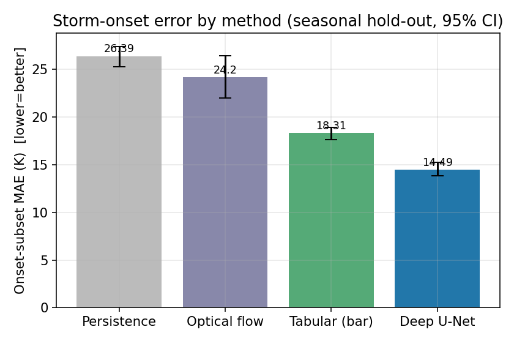 | 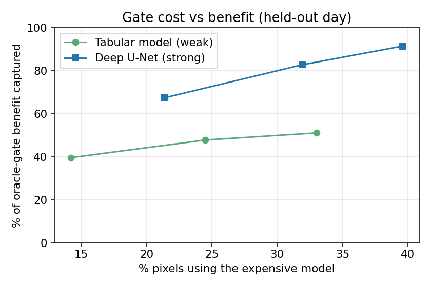 |
| **Multi-region signal** | **Deep-in-gate** |
| 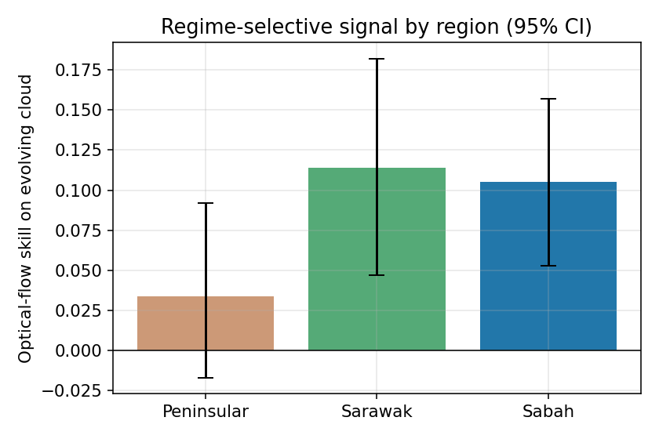 | 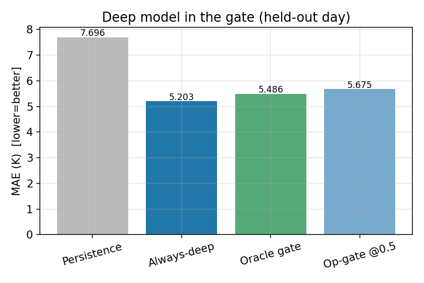 |

---

## The prototype

The research above powers an interactive web dashboard that turns the forecast into plain-language advice for households and facility managers. A visual walkthrough:

| | |
|---|---|
| **Live tropical sky** — the Himawari-9 cloud field the system watches | **Storm heads-up** — an early alert with a timing buffer |
| 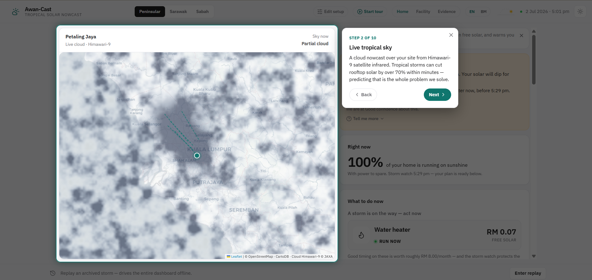 | 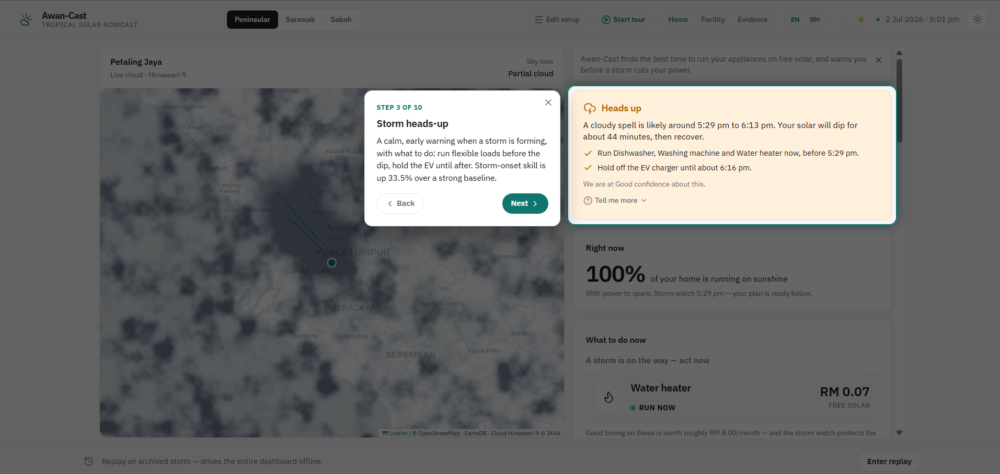 |
| **What to do now** — one clear action and its ringgit value | **Recommendations** — cheapest solar window per appliance |
| 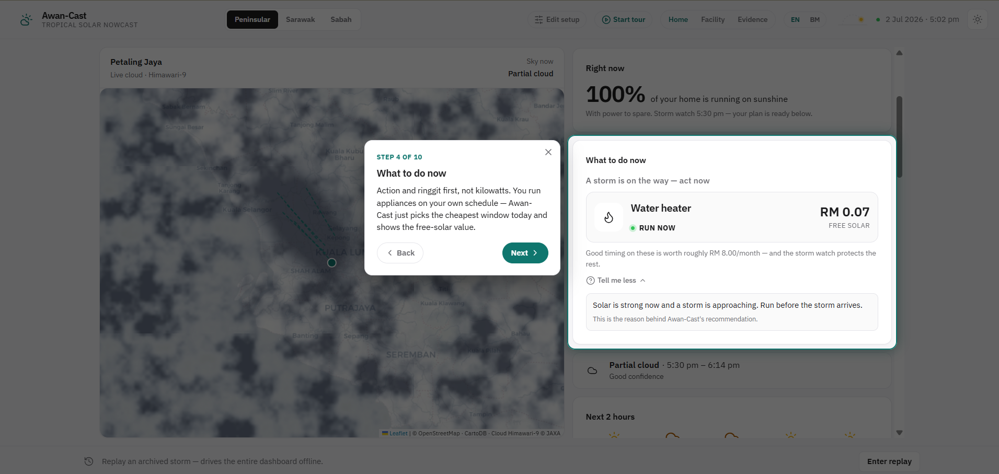 | 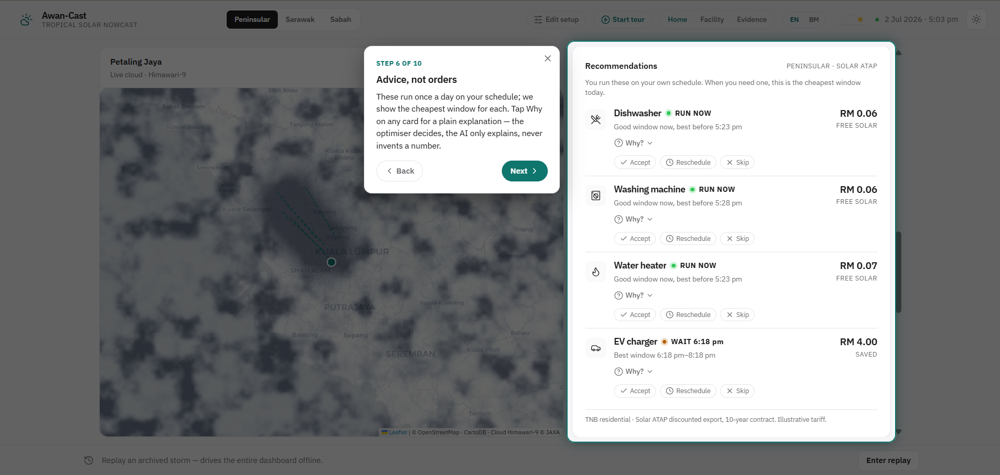 |
| **A promise, not a hope** — the coverage guarantee in plain language | **The big money** — protecting a facility's monthly peak charge |
| 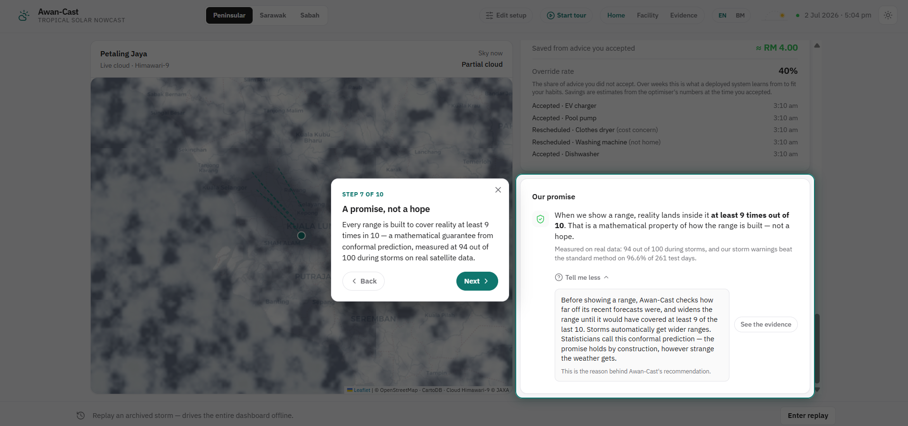 | 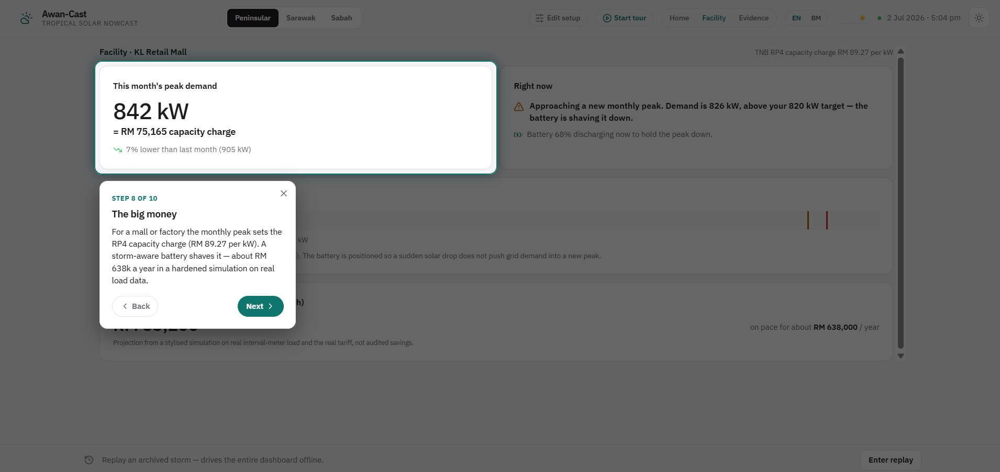 |
| **Free-solar windows** — net-load surplus made visible | **Your month on sunshine** — self-consumption and savings |
| 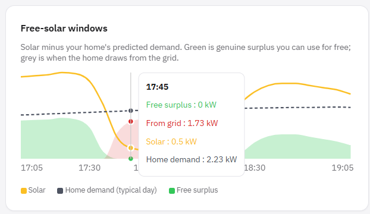 | 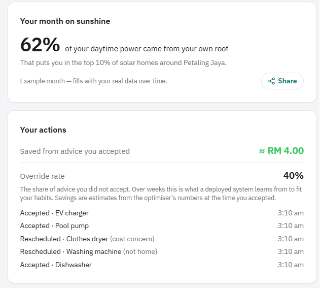 |

The full screenshot set (setup, three-scheme coverage, forecast strip, evidence view, etc.) is in [`assets/screenshots/`](assets/screenshots/).

---

## Repository structure

```
awancast/
├── experiments/        # All experiment code (Python) + outputs (JSON results, RESULT_*.md)
│   ├── README.md       # Reproducibility manifest: command → output → headline for every experiment
│   ├── *.py            # 28 experiment scripts (baselines, gate, deep models, conformal, decision value)
│   ├── *_results.json  # Machine-readable results for each experiment
│   └── RESULT_*.md     # Human-readable write-up for each experiment
├── data/               # Data-acquisition scripts (the datasets themselves are NOT included)
│   ├── fetch_*.py      # NSRDB, Himawari, ComStock downloaders
│   ├── build_panel.py  # Seasonal panel builder
│   └── DATA_GUIDE.md   # Where each dataset comes from and how to rebuild it
├── paper/figures/      # Publication figures generated by experiments/make_figures.py
├── assets/
│   ├── diagrams/       # System architecture diagrams
│   └── screenshots/    # Prototype dashboard walkthrough
├── requirements.txt
└── README.md
```

---

## Reproducing the experiments

Most experiments are CPU-runnable; those marked GPU in the manifest need a CUDA device. Python 3.13, fixed seed = 0.

```bash
# 1. Install dependencies
pip install -r requirements.txt

# 2. Acquire data (see data/DATA_GUIDE.md — you need a free NREL API key for NSRDB)
python data/fetch_nsrdb.py       # ground-truth GHI, Petaling Jaya
python data/fetch_himawari.py    # Himawari-9 B13 IR frames (anonymous AWS Open Data)

# 3. Run an experiment (each writes a *_results.json and RESULT_*.md)
python experiments/baseline_nowcast.py      # B1: storm onset is the dominant error
python experiments/significance_b1.py       # bootstrap CIs for the onset gain
python experiments/end_to_end_gate.py       # the regime-selective gate
python experiments/conformal_upgrade.py     # calibrated uncertainty
python experiments/make_figures.py          # regenerate paper/figures/*.png
```

See [`experiments/README.md`](experiments/README.md) for the exact command, output file, and headline result of every experiment, plus the train/test splits and sample sizes.

---

## Data sources

Raw data is **not** committed (it is large and externally hosted). Each source is public and reproducible via the scripts in `data/`:

| Dataset | Source | Used for |
|---|---|---|
| NSRDB GHI, Petaling Jaya (2016–2020) | NREL NSRDB | Ground-truth irradiance; baselines & significance |
| Himawari-9 B13 IR frames | AWS Open Data `noaa-himawari9` (anonymous) | Cloud-top temperature nowcasting |
| Hong Kong rooftop PV (2021–2023) | Dryad `doi:10.5061/dryad.m37pvmd99` | Scheduler proxy |
| ComStock C&I load (RetailStandalone, FL) | NREL ComStock (OEDI, anonymous) | Hardened commercial peak-shaving simulation |

---

## Honesty note

This project separates **measured** results from **projections**:

- The **forecasting** results (onset skill, gate efficiency, calibration coverage, detector AUC) are **measured** on real data with confidence intervals, and were cross-checked by an independent second AI model (see `experiments/EXPERIMENT_AUDIT.md`).
- The **economic** figures (e.g. the ~RM 638k/year commercial saving) come from a **hardened simulation** on real load and a real causal forecast — they are **projections of decision value, not audited deployment savings**. Where an earlier framing over-stated the forecast-specific value, it is flagged and corrected in the RESULT files rather than hidden.

---

## License

Released under the [MIT License](LICENSE).

---

*Awan-Cast — turning a hard tropical forecasting problem into the two things a household or facility manager actually cares about: the confidence to act, and money that would otherwise be lost.*
